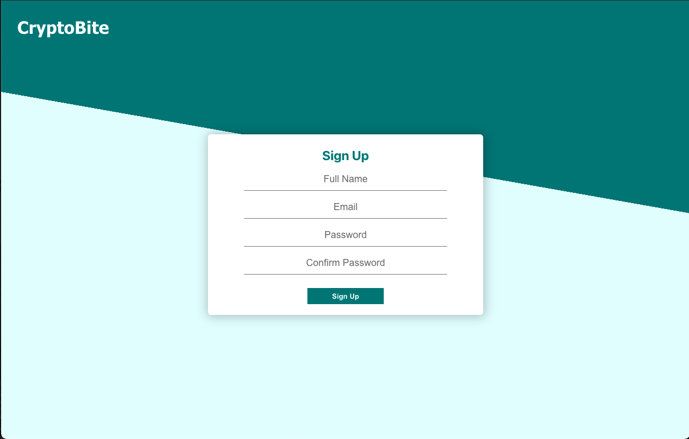

# Crypto_Wallet_React_App

## Motivation

With Cryptos becoming more popular, the demand for apps with the ability to track the performance as well as buying/selling coins has gone up.

## Tech Stack

This CryptoBite app was built using an express backend with MongoDB to hold user API. The frontend was built using React with ChartJS in order to display the historical price of coins.

## Installation

### `git clone https://github.com/Li-Ri/Crypto_Wallet_React_App.git`

Dependencies need to be installed in order for the app to run and so the following must be done:

1. Navigate to client folder from the terminal
2. ### `npm install`
3. Now navigate to server folder
4. ### `npm install`

All the dependencies should now be installed

## Testing

A number of unit and UI tests were written to test the app and can be ran with the following:

### `npm test`

## Running the App

from the server directory run:

### `npm run server:dev`

from the client directory:

### `npm start`

the app will now be running and viewable on ports 3000 and 5000.

### APIS

In order to obtain the coin data and display it on the front end, an external api had to be used. There were two that were implemented in this app and they were:

- https://finage.co.uk/docs/api/getting-started
- https://min-api.cryptocompare.com

## Screenshots

### Login Page

### Sign Up Page

### DashBoard

